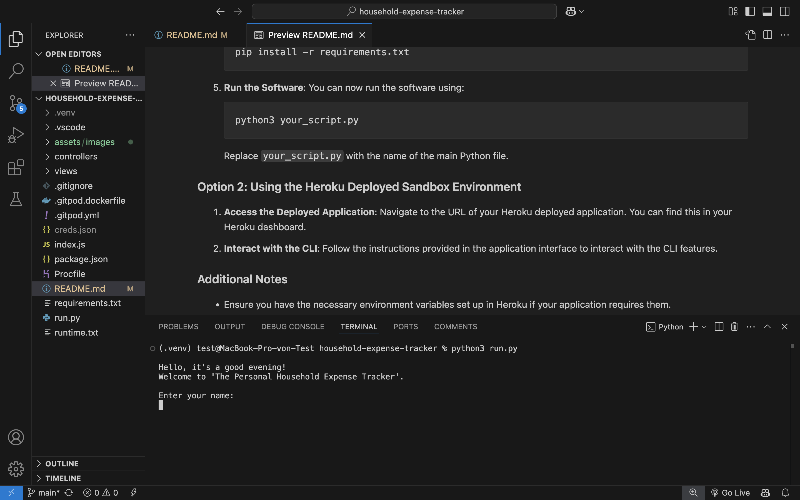
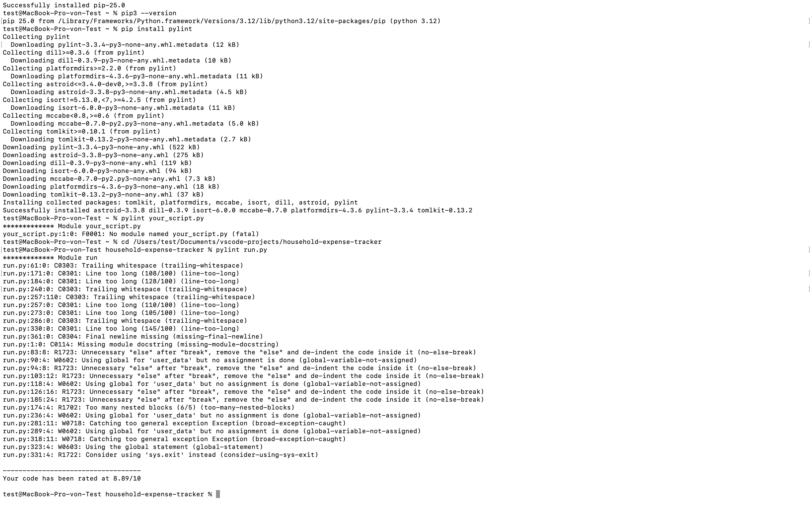
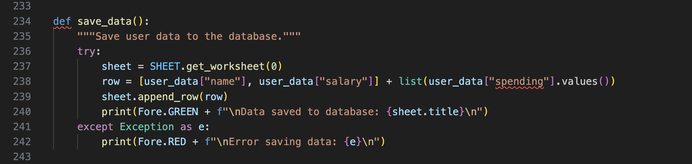
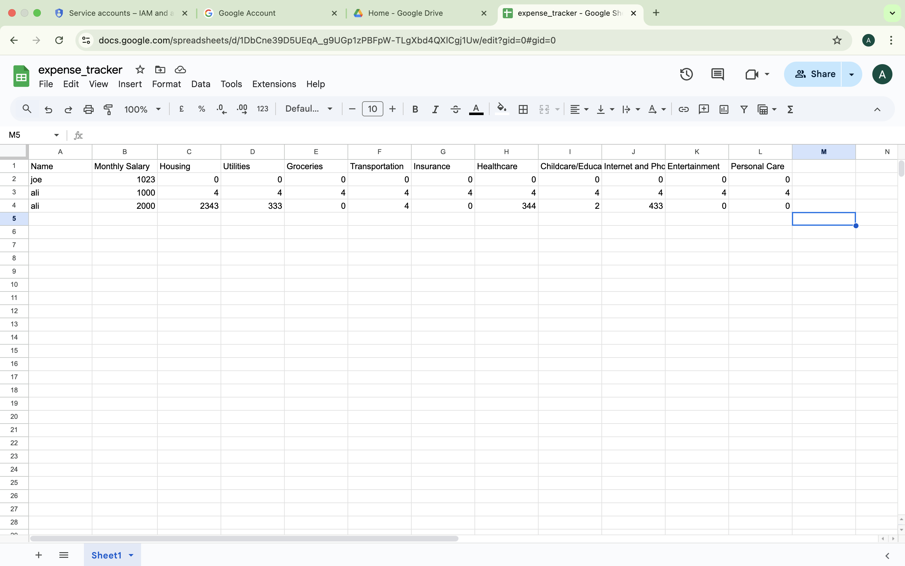
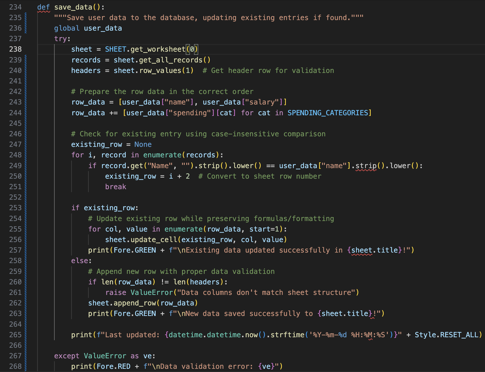

# Personal Household Expense Forecast

## Overview
This software helps users track their household expenses, analyze spending habits, and forecast savings. It provides a user-friendly interface and integrates with Google Sheets for data storage. it is not focused on tracking spending rather focused on setting spendings and savings thresholds and goals all while helping the user prioritise spending in the household on different criterias.

Here's the entire section formatted in Markdown:

```markdown
## Running the Software

You can run this CLI software by either forking/cloning the repository or using the Heroku deployed sandbox environment.

### Option 1: Forking/Cloning the Repository

1. **Fork the Repository**: Click the "Fork" button on the top right of this repository to create your own copy.

2. **Clone the Repository**: Open your terminal and run the following command to clone your forked repository:

   ```bash
   git clone https://github.com/your-username/repository-name.git
   ```

   Replace `your-username` and `repository-name` with your GitHub username and the name of this repository.

3. **Navigate to the Directory**:

   ```bash
   cd repository-name
   ```

4. **Install Dependencies**: Make sure you have Python 3 installed. Then, install the required packages by running:

   ```bash
   pip install -r requirements.txt
   ```

5. **Run the Software**: You can now run the software using:

   ```bash
   python3 your_script.py
   ```

   Replace `your_script.py` with the name of the main Python file.

   


### Option 2: Using the Heroku Deployed Sandbox Environment

1. **Access the Deployed Application**: Navigate to the URL of your Heroku deployed application. You can find this in your Heroku dashboard.

2. **Interact with the CLI**: Follow the instructions provided in the application interface to interact with the CLI features.

### Additional Notes

- Ensure you have the necessary environment variables set up in Heroku if your application requires them.
- For any issues, please refer to the troubleshooting section or open an issue in this repository.


### Flowchart
The flowchart outlines the structured and systematic workflow of the project. It represents the logical flow of processes, decision points, and task dependencies.

link: https://lucid.app/lucidchart/0cdb2379-ffe9-4dac-abee-73d746e468e1/edit?viewport_loc=115%2C-241%2C4139%2C2500%2C0_0&invitationId=inv_0a7cc6fc-3db3-4d46-af63-84607c2ee25e


### Mind Map
The mind map captures the initial brainstorming and ideation phase of the project. It is an unstructured and exploratory space where ideas, inspirations, and concepts are freely organized.

link: Link: https://lucid.app/lucidspark/dc677aee-e42e-4469-820b-db2807b9af34/edit?viewport_loc=-7139%2C-514%2C13247%2C7470%2C0_0&invitationId=inv_9c2fad69-7430-4722-ab49-03c1d67ae812


---

## Features
1. **User Input Validation**: Collects and validates user input for name, salary, and spending amounts. Handles empty or invalid input data gracefully.  
2. **Expense Tracking**: Predefined spending categories with descriptions. Collects monthly spending data for each category.  
3. **Financial Analysis**:  
   - **Current Savings**: Calculates current monthly and annual savings.  
   - **Potential Savings**: Analyzes how much a user could save by reducing spending in specific categories.  
   - **12-Month Forecasting**: Projects savings and expenses over the next 12 months based on current financial data.  
4. **Data Persistence**: Saves user data to Google Sheets for future reference. Loads user data from Google Sheets based on the user's name.  
5. **User-Friendly Interface**:  
   - **Color-Coded Terminal Output**: Enhances readability with colored text (e.g., red for warnings, green for success messages).  
   - **Sticky Menu**: Allows users to navigate the application easily without returning to the main menu after every action.  
6. **Error Handling**: Implements exception handling to optimize the user experience.  
7. **Menu System**: Provides a clear and intuitive way to interact with the app, including options to save/load data, reset the system, and analyze finances.  

---

## Target Audience
The **Personal Household Expense Tracker** is designed for:  
- **Individuals**: Anyone looking to track and manage their monthly expenses and savings.  
- **Families**: Households that want to plan their finances and identify areas for potential savings.  
- **Budget-Conscious Users**: People who want to gain insights into their financial health and make informed decisions.  
- **Non-Technical Users**: The app is user-friendly and does not require advanced technical knowledge to use.  

---

## How to Use It
1. **Run the Application**:  
   ```bash
   python expense.py
   ```  
2. **Enter Your Information**:  
   - Provide your name and monthly salary.  
   - Input spending amounts for each predefined category (e.g., Housing, Groceries, Transportation).  
3. **Use the Menu**:  
   - **Calculate Current Savings**: View your monthly and annual savings.  
   - **Analyze Potential Savings**: Identify areas where you can reduce spending and calculate potential savings.  
   - **Forecast 12-Month Savings**: Project your savings and expenses over the next year.  
   - **Save/Load Data**: Save your data to Google Sheets or load previously saved data.  
   - **Reset System**: Clear all data and start over.  
   - **Quit**: Exit the application.  

---

## Output Examples for Each Function

### 1. **Greet User**
When the application starts, the user is greeted based on the time of day:

```
Hello, it's a good morning!
Welcome to 'The Personal Household Expense Tracker'.
```

---

### 2. **Collect User Info**
The user is prompted to enter their name and monthly salary:

```
Enter your name: Ali El Haj
Enter your monthly salary (in USD): 3000

Great, your data will remain private.
```

---

### 3. **Display Spending Categories**
The user is shown the predefined spending categories and descriptions:

```
Here's your household spending categories. Take a look at them before providing data:
- Housing: Rent or mortgage payments
- Utilities: Electricity, gas, water, and trash services
- Groceries: Food and household supplies
- Transportation: Fuel, public transport, or vehicle maintenance
- Insurance: Health, home, auto, or life insurance premiums
- Healthcare: Out-of-pocket medical expenses, prescriptions, and dental care
- Childcare/Education: Tuition, daycare, or extracurricular activities for children
- Internet and Phone: Monthly bills for internet service and mobile phone plans
- Entertainment: Subscriptions (like Netflix), dining out, and recreational activities
- Personal Care: Toiletries, haircuts, and other cosmetics

Type 'Y' to continue: Y
```

---

### 4. **Collect Spending**
The user enters their monthly spending for each category:

```
Please enter your monthly spending for each category (enter 0 if not applicable):

Housing: 1000
Utilities: 200
Groceries: 300
Transportation: 150
Insurance: 100
Healthcare: 50
Childcare/Education: 0
Internet and Phone: 100
Entertainment: 200
Personal Care: 50

Spending data collected successfully.
```

---

### 5. **Display Menu**
The user is shown the sticky menu with action options:

```
--- Menu ---
a. Calculate current monthly/annual savings
b. Analyze potential savings by category
c. Forecast 12-month spending/savings
d. Save data to database
e. Load data from database
f. Reset and restart system
g. Quit system
------------

Select an option (a-g): 
```

---

### 6. **Calculate Current Savings**
The application calculates and displays the user's current savings:

```
--- Current Savings ---
Monthly Salary: $3000.00
Monthly Expenses: $2150.00
Monthly Savings: $850.00
-----------------------
Annual Salary: $36000.00
Annual Expenses: $25800.00
Annual Savings: $10200.00
-----------------------
```

---

### 7. **Analyze Potential Savings**
The user selects categories to reduce spending and enters reduction percentages:

```
Select categories to reduce spending:
1. Housing
2. Utilities
3. Groceries
4. Transportation
5. Insurance
6. Healthcare
7. Childcare/Education
8. Internet and Phone
9. Entertainment
10. Personal Care

Enter the numbers of categories (comma-separated): 9
Enter the percentage reduction for Entertainment (e.g., 10 for 10%): 20
Potential savings for Entertainment: $40.00

Total potential savings: $40.00
```

---

### 8. **Forecast Savings**
The application forecasts savings and expenses over the next 12 months:

```
--- 12-Month Forecast ---
Monthly Salary: $3000.00
Monthly Expenses: $2150.00
Monthly Savings: $850.00
-------------------------
Month 1:
  Cumulative Savings: $850.00
  Cumulative Expenses: $2150.00
Month 2:
  Cumulative Savings: $1700.00
  Cumulative Expenses: $4300.00
...
Month 12:
  Cumulative Savings: $10200.00
  Cumulative Expenses: $25800.00
-------------------------
Total Annual Savings: $10200.00
Total Annual Expenses: $25800.00
-------------------------
```

---

### 9. **Save Data**
The user saves their data to the database:

```
Data saved to database: expense_tracker
```

---

### 10. **Load Data**
The user loads their saved data by entering their name:

```
Enter your name to load your data: Ali El Haj
Data loaded successfully!
```

---

### 11. **Reset System**
The user resets the system to clear all data:

```
System reset. Restarting...
```

---

### 12. **Quit System**
The user exits the application:

```
Thank you for using 'The Personal Household Expense Tracker'! Keep tracking and managing your expenses effectively.
```

---

### Example Workflow
Here’s an example of a full user interaction:

```
Hello, it's a good morning!
Welcome to 'The Personal Household Expense Tracker'.

Enter your name: Ali El Haj
Enter your monthly salary (in USD): 3000

Great, your data will remain private.

Here's your household spending categories. Take a look at them before providing data:
- Housing: Rent or mortgage payments
- Utilities: Electricity, gas, water, and trash services
- Groceries: Food and household supplies
- Transportation: Fuel, public transport, or vehicle maintenance
- Insurance: Health, home, auto, or life insurance premiums
- Healthcare: Out-of-pocket medical expenses, prescriptions, and dental care
- Childcare/Education: Tuition, daycare, or extracurricular activities for children
- Internet and Phone: Monthly bills for internet service and mobile phone plans
- Entertainment: Subscriptions (like Netflix), dining out, and recreational activities
- Personal Care: Toiletries, haircuts, and other cosmetics

Type 'Y' to continue: Y

Please enter your monthly spending for each category (enter 0 if not applicable):

Housing: 1000
Utilities: 200
Groceries: 300
Transportation: 150
Insurance: 100
Healthcare: 50
Childcare/Education: 0
Internet and Phone: 100
Entertainment: 200
Personal Care: 50

Spending data collected successfully.

--- Menu ---
a. Calculate current monthly/annual savings
b. Analyze potential savings by category
c. Forecast 12-month spending/savings
d. Save data to database
e. Load data from database
f. Reset and restart system
g. Quit system
------------

Select an option (a-g): a

--- Current Savings ---
Monthly Salary: $3000.00
Monthly Expenses: $2150.00
Monthly Savings: $850.00
-----------------------
Annual Salary: $36000.00
Annual Expenses: $25800.00
Annual Savings: $10200.00
-----------------------

Select an option (a-g): g

Thank you for using 'The Personal Household Expense Tracker'! Keep tracking and managing your expenses effectively.
```

---


## Functionality
The software includes key functions such as:

- Greeting the user based on the time of day.
- Displaying a list of predefined spending categories.
- Collecting the user's name and monthly salary, with input validation.
- Collecting monthly spending amounts for each category.
- Showing a menu with various options for user interaction.
- Calculating current monthly and annual savings based on salary and spending.
- Allowing users to analyze potential savings by reducing spending in selected categories.
- Forecasting savings and expenses over the next 12 months.
- Saving user data to a Google Sheet.
- Loading user data from a Google Sheet.
- Resetting the system to clear user data.
- Quitting the system with a farewell message.
- Running the main program and managing user interactions.

## Readability
The code is structured to be readable, following proper indentation and including comments that clarify the purpose of functions and sections.

## Input Data Handling
The code includes multiple input validations to ensure that user data is correct. Here are the key aspects:

1. Name Input Validation
   - The name must only contain letters and spaces. If invalid, the user is prompted to re-enter it.

2. Salary Input Validation
   - Salary must be a positive number. Negative or non-numeric inputs prompt the user to re-enter.

3. Spending Amount Validation
   - Spending amounts for each category must be non-negative numbers. Invalid inputs prompt re-entry.

4. Menu Option Validation
   - Users must select valid menu options. Invalid selections prompt re-entry.

5. Category Selection Validation
   - Users must enter valid category numbers. Invalid inputs prompt re-entry.

6. Percentage Reduction Validation
   - The percentage reduction for a category must be between 0 and 100. Invalid inputs prompt re-entry.

7. Google Sheets Data Validation
   - The number of data columns must match the headers in the Google Sheet. Mismatches prevent saving.

8. Data Loading Validation
   - The program checks if the user's name exists in the Google Sheet. If not found, an error message appears.

9. Error Handling
   - Errors during Google Sheets API operations are caught and managed gracefully, providing user feedback.

### Summary of Input Handling
- Data type validation ensures inputs are correct.
- Range validation confirms inputs are within acceptable limits.
- Format validation checks that inputs meet expected patterns.
- Error handling provides clear prompts for invalid inputs.
- Data integrity ensures saved and loaded data is consistent.

## Code Structure
The code is organized into small functions, each addressing specific tasks. This modular approach enhances readability, maintainability, and testing.

## Testing
The software has undergone manual testing and debugging to verify functionality. Linter checks were conducted to maintain code quality.

 

 score: 8.89


 # Steps to Enable Google Sheets API

## Step 1: Create a Google Cloud Project
1. Go to the **Google Cloud Console**.
2. Click on the project drop-down and select **New Project**.
3. Enter a name for your project and click **Create**.

## Step 2: Enable the Google Sheets API
1. In  project dashboard, click on **APIs & Services** > **Library**.
2. Search for "Google Sheets API" and click on it.
3. Click **Enable**.

## Step 3: Create Service Account
1. Navigate to **APIs & Services** > **Credentials**.
2. Click on **Create Credentials** and select **Service Account**.
3. Fill in the service account details (name, description) and click **Create**.
4. In the next step, you can assign roles. For basic access, select **Editor** or **Viewer**. Click **Continue**.
5. Click **Done**.

## Step 4: Generate Service Account Key
1. After creating the service account, you will be redirected to the service accounts page. Click on the service account you just created.
2. Go to the **Keys** tab and click **Add Key** > **Create New Key**.
3. Choose **JSON** as the key type and click **Create**. This will download a JSON file containing your service account credentials (e.g., `creds.json`).

## Step 5: Share Google Sheet with Service Account
1. Open the Google Sheet you want to access.
2. Click on the **Share** button in the top right corner.
3. In the **Share with people and groups** window, enter the client email from your downloaded JSON file (it looks like `your-service-account@your-project.iam.gserviceaccount.com`).
4. Set the permissions (e.g., **Viewer** or **Editor**) and click **Send**.

## Step 6: Link to Your Code
1. Ensure your `creds.json` file (the one you downloaded) is in the same directory as your Python script.
2. In your Python script, add the following lines to authenticate and access your Google Sheet:

    ```python
    from google.oauth2.service_account import Credentials
    import gspread

    SCOPE = [
        "https://www.googleapis.com/auth/spreadsheets",
        "https://www.googleapis.com/auth/drive.file",
        "https://www.googleapis.com/auth/drive"
    ]

    CREDS = Credentials.from_service_account_file('creds.json')
    SCOPED_CREDS = CREDS.with_scopes(SCOPE)
    GSPREAD_CLIENT = gspread.authorize(SCOPED_CREDS)
    SHEET = GSPREAD_CLIENT.open("expense_tracker")  # Replace with your Google Sheet name
    ```

## Step 7: Run Your Code
Now that everything is set up, you can run your Python script. It should authenticate with the Google Sheets API and interact with your specified Google Sheet without any issues.


### Issue and solution

- issue:
 Repeated saves create duplicate entries instead of updating.
 
 

- solution:  

- Get the worksheet.
- Get all records as a list of dictionaries.
- Loop through each record, check if the 'Name' matches.
- If found, note the index, calculate the row number (index + 2).
- Prepare the row data as a list, same as before.
- Use sheet.update(row_number, [row_data]) to update that row.
- If not found, append the row as before.



## Deployment Steps

This section outlines the steps taken to deploy the software on Heroku and connect it with GitHub.

### Prerequisites

- Ensure you have a Heroku account.
- Install the Heroku CLI on your local machine.
- Have your GitHub repository ready.

### Steps to Deploy

1. **Log in to Heroku**:
   Open your terminal and log in to your Heroku account:

   ```bash
   heroku login

- Create a New Heroku Application:
```bash
heroku create your-app-name
```

- Link Your GitHub Repository:
```bash
heroku git:remote -a your-app-name
```
- Set Up Environment Variables:
```bash
heroku config:set VARIABLE_NAME=value
```
- Deploy the Application:
```bash
git push heroku main
```

- Open Your Application:
```bash
heroku open
```

- Monitor Logs:
To check the logs for any issues, use:
```bash
heroku logs --tail
```
## Conclusion

Future enhancements will include:

- Implementing visualizations and graphs for the forecast function to offer better insights into spending and savings.
- Using the geolocation API to greet users based on their location, adding a personalized touch to the experience.